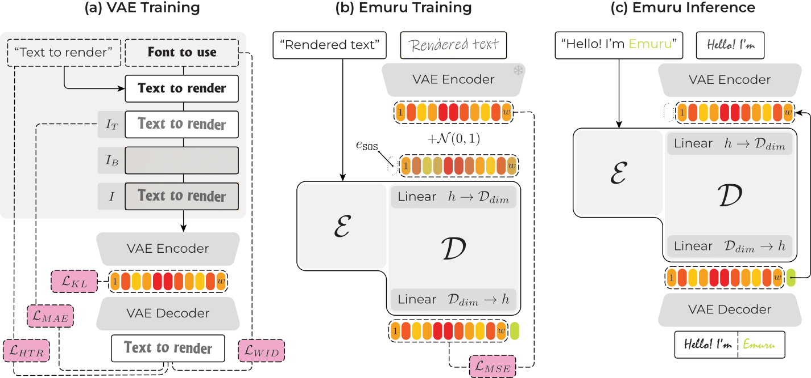

# Zero-Shot-Styled-Text-Image-Generation-but-Make-It-Autoregressive
Official PyTorch implementation for "Zero-Shot Styled Text Image Generation, but Make It Autoregressive" (CVPR25)


[](https://openaccess.thecvf.com/content/CVPR2025/html/Pippi_Zero-Shot_Styled_Text_Image_Generation_but_Make_It_Autoregressive_CVPR_2025_paper.html)
[](https://arxiv.org/pdf/2503.17074)
[](https://fabioquattrini.com/posters/Emuru.pdf)

[](
https://huggingface.co/datasets/blowing-up-groundhogs/font-square-v2)
[](
https://huggingface.co/blowing-up-groundhogs/emuru_vae)
[](
https://huggingface.co/blowing-up-groundhogs/emuru)
[](https://github.com/aimagelab/HWD)


[Introduction](#introduction) • [Installation](#installation) • [Training](#training) • [Evaluation](#evaluation) • [Inference](#inference) • [Configuration](#configuration-parameters) • [Citation](#citation)

---


## Introduction
Official PyTorch implementation for "Zero-Shot-Styled-Text-Image-Generation-but-Make-It-Autoregressive", presenting **Emuru**: a conditional generative model that integrates a T5-based decoder with a Variational Autoencoder (VAE) for image generation conditioned on text and style images. It allows users to combine textual prompts (e.g., style text, generation text) and style images to create new, synthesized images.

The code is tested on Python 3.11.13, CUDA 12.8, and PyTorch 2.7.1 using a NVIDIA RTX 4090 GPU.

We use the [Accelerate](https://huggingface.co/docs/accelerate/index) library for multi-GPU training and [Wandb](https://wandb.ai/site/) for logging.


<p align="center">
  
</p>
<p align="center">
   Overview of the proposed Emuru.
</p>

## Installation
Install the required Python packages to train the model:
```console
conda create --name emuru python=3.11.13
conda activate emuru
pip install -r requirements.txt
```


## Training

Our model is composed of a Variational Autoencoder and a T5 Decoder. We provide all intermediate artifacts in the [Releases](https://github.com/aimagelab/Zero-Shot-Styled-Text-Image-Generation-but-Make-It-Autoregressive/releases), but you can train your own following the next steps.

This code is set to stream our synthetic dataset [Font-Square](https://huggingface.co/datasets/blowing-up-groundhogs/font-square-v2).

Here we provide a minimal set of examples, with more details on parameters in the dedicated [Section](https://github.com/aimagelab/Zero-Shot-Styled-Text-Image-Generation-but-Make-It-Autoregressive/blob/main/README.md#configuration-parameters).

### Train the T5
You can either provide the path to your trained VAE [Guide](#train-the-vae) or load the pretrained VAE from [Huggingface](https://huggingface.co/blowing-up-groundhogs/emuru_vae/blob/main/README.md) (which we also provide in this [Release](https://github.com/aimagelab/Zero-Shot-Styled-Text-Image-Generation-but-Make-It-Autoregressive/releases/tag/emuru_vae)):
```console
python train_T5.py --vae_path "blowing-up-groundhogs/emuru_vae"
```

### Train the VAE (Optional)
Training the VAE from scratch requires setting up auxiliary models for text correctness (HTR) and style (Writer ID) losses. If you don't want to train your own, you can use our [pre-trained VAE from Hugging Face](https://huggingface.co/blowing-up-groundhogs/emuru_vae).

**Step 1: Set Up Auxiliary Models**
You have two options: download our pre-trained ones or train your own.

* **Option A: Download Pre-trained Auxiliary Models (Recommended)**

```console
mkdir -p pretrained_models
wget -P pretrained_models https://github.com/aimagelab/Zero-Shot-Styled-Text-Image-Generation-but-Make-It-Autoregressive/releases/download/emuru_vae_htr/emuru_vae_htr.tar.gz
wget -P pretrained_models https://github.com/aimagelab/Zero-Shot-Styled-Text-Image-Generation-but-Make-It-Autoregressive/releases/download/emuru_vae_wid/emuru_vae_wid.tar.gz
tar -xzvf pretrained_models/emuru_vae_htr.tar.gz -C pretrained_models/
tar -xzvf pretrained_models/emuru_vae_wid.tar.gz -C pretrained_models/
```

* **Option B: Train Auxiliary Models From Scratch**

1. Train the Handwritten Text Recognition Model:
```console
python train_htr.py
```

2. Train the Writer Identification Model:
```console
python train_writer_id.py
```

**Step 2: Train the VAE**
Once the auxiliary models are in the `pretrained_models/` directory, you can start the VAE training.
```bash
python train_vae.py --htr_path "pretrained_models/emuru_vae_htr" --writer_id_path "pretrained_models/emuru_vae_writer_id"
```


## Evaluation
We compare **Emuru** with several state-of-the-art generative models, including [DiffusionPen](https://github.com/koninik/DiffusionPen), [One-DM](https://github.com/dailenson/One-DM),  [VATr++](https://github.com/EDM-Research/VATr-pp), [VATr](https://github.com/aimagelab/VATr), and [HiGANplus](https://github.com/ganji15/HiGANplus). 
We use the library [HWD](https://github.com/aimagelab/HWD).

## Inference
For inference, please refer to the guide on [HuggingFace](https://huggingface.co/blowing-up-groundhogs/emuru).

## Configuration Parameters

This section details some of the command-line arguments you can use to configure the training scripts.
Common ones are:

| Parameter | Default | Description |
| :--- | :--- | :--- |
| **`--run_id`** | (random) | A unique ID for the current run, generated automatically. |
| **`--eval_epochs`** | `1` | How often to run evaluation, in epochs. |
| **`--report_to`** | `None` | Platform to report metrics to (e.g., `wandb`). |
| **`--wandb_project_name`**| `emuru_vae` | The project name on Weights & Biases. |
| **`--wandb_entity`** | `None` | Your W&B entity (username or team name). |
| **`--wandb_log_interval_steps`** | `25` | How often to log metrics to W&B, in steps. |
| **`--checkpoints_total_limit`** | `5` | The maximum number of checkpoints to keep. | 
| **`--resume_id`** | `None` | ID of a previous run to resume training from. |
| **`--epochs`** | `10000` | The total number of training epochs. |
| **`--lr`** | `1e-4` | The initial learning rate. |
| **`--lr_scheduler`** | `reduce_lr_on_plateau` | The type of learning rate scheduler to use. |
| **`--lr_scheduler_patience`**| `5` | Patience in epochs for the LR scheduler before reducing the learning rate. |
| **`--gradient_accumulation_steps`**| `1` | Number of steps to accumulate gradients before an optimizer step. |
| **`--seed`** | `24` | Random seed for ensuring reproducibility. |
| **`--mixed_precision`** | `no` | Whether to use mixed precision training. Options: `no`, `fp16`, `bf16`. |

### T5 Training

#### File Paths and Directories
| Parameter | Default | Description |
| :--- | :--- | :--- |
| **`--output_dir`** | `results_t5` | Directory to save model checkpoints and outputs. |
| **`--logging_dir`** | `results_t5` | Directory where logs will be stored. |
| **`--vae_path`** | `blowing-up-groundhogs/emuru_vae`| Path to the pre-trained VAE checkpoint on the Hugging Face Hub. |


---

#### Training Hyperparameters
| Parameter | Default | Description |
| :--- | :--- | :--- |
| **`--training_type`** | `pretrain` | Set the training mode. Options: `pretrain`, `finetune`. |
| **`--train_batch_size`**| `2` | The batch size for the training dataset. |
| **`--eval_batch_size`** | `8` | The batch size for the evaluation dataset. |
| **`--teacher_noise`** | `0.1` | Amount of noise added during teacher-forcing. |

---


### VAE

#### File Paths and Directories
| Parameter | Default | Description |
| :--- | :--- | :--- |
| **`--output_dir`** | `results_vae` | Directory to save model checkpoints and outputs. |
| **`--logging_dir`** | `results_vae` | Directory where logs will be stored. |
| **`--vae_config`** | `configs/vae/VAE_64x768.json` | Path to the VAE's JSON configuration file. |
| **`--htr_path`** | `pretrained_models/emuru_vae_htr` | Path to the HTR model checkpoint for the auxiliary loss. |
| **`--writer_id_path`**| `pretrained_models/emuru_vae_writer_id` | Path to the Writer ID model checkpoint for the auxiliary loss. |

---

#### Training Hyperparameters
| Parameter | Default | Description |
| :--- | :--- | :--- |
| **`--train_batch_size`**| `16` | The batch size for the training dataset. |
| **`--eval_batch_size`** | `16` | The batch size for the evaluation dataset. |


---


## Citation

If you find it useful, please cite it as:
```
@InProceedings{Pippi_2025_CVPR,
    author    = {Pippi, Vittorio and Quattrini, Fabio and Cascianelli, Silvia and Tonioni, Alessio and Cucchiara, Rita},
    title     = {Zero-Shot Styled Text Image Generation, but Make It Autoregressive},
    booktitle = {Proceedings of the IEEE/CVF Conference on Computer Vision and Pattern Recognition (CVPR)},
    month     = {June},
    year      = {2025},
    pages     = {7910-7919}
}
